```{r setup, include=FALSE}
knitr::opts_chunk$set(echo = TRUE)
```


# Introduction 
 <font size=5pt> The data visualization below is created by using data on Resident Labour Force Participation Rate by Age and Sex provided by Ministrty of Manpower, Singapore (MOM).The data provide us basic statistical number like the resident labour force participation rate by age and sex from 1991-2021 in Singapore for audience to do further discussion and analysis. 

<p>The chart we need to revise is displayed below: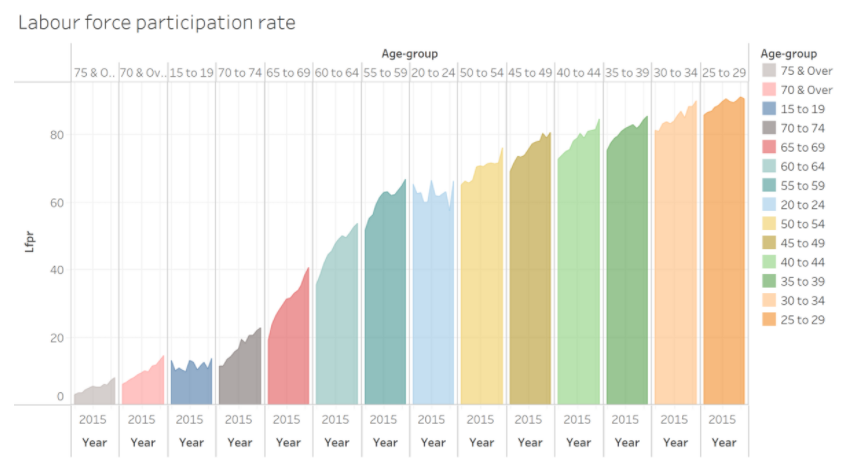 


# Critque on Clarity and Aesthetics


## Improper Title and Labeling
### Title
The title for the graph is "Labour force participation rate" that is too general to give audience a first clear impression about what the graph is about. Also reference to the basic principle for designing a statistical chart(https://isss608-ay2021-22t2.netlify.app/lesson/lesson02/lesson02-designing-graphs-to-enlighten#62), it would be more appropriate to set the title stated: "Labour force participation percentage by age in Singapore in 2005-2021".


### X-axis and y-axis label
We should avoid abbreviation for label in both x-axis and y-axis to prevent misunderstanding on our value. And we are providing percentage on y-axis,so it would be more clearly if we replace "Lfpr" with "Labour participation rate(%)" on y-axis.We could delete "Year" on every column to eliminate some redundancy on x-axis. 

##  Backgroud
The clarity is also important for a graph, as we could see from the graph the background of our graph has some light grids, which are useless for marking values. It would be better we hide those grids away for our graph. 


## Content 
### X-axis measurement
Since we are trying to show the difference of labour force participation rate between different age groups, we need to put all age group under one dimension rather than separate them and put them into different boxes. We prefer to put all age group under one common x-axis.

### Graph type
The graph is applying a histogram graph to the data, which may not provide a better comparison in labour participation rate in different group because of horizontally overlapping of different age group. It might be better if we using line chart to fully display the difference between various age groups.

## Age group
### Order
Since age is a meaningful measure in real life, we could sort and display them in ascending order instead of putting them in random order for providing better and effective to our audience.


### Color
The graph just has random different color for each age group, which is not appropriate in this scenario. We could replace the random color of each age group by another way that giving color from light to dark according to age group from "younger" to "older".

# A sketch of the improved visualization

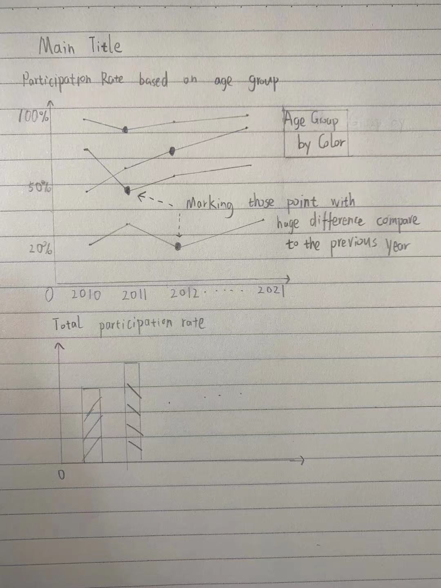
We are trying to provide audience a participating rate changing within every single age group group and a comparison in percentage of labour participating, so we design to provide a line chart sorting by age group. We also want to indicate some fluctuation over three percent to find some interesting factors that might explain such 
abnormal fluctuations.Since the original graph does not provide audience the difference between different age group effectively. The bottom graph is showing the total labour participating rate during 2010-2021 to provide audience an indicator to better understand the whole situation for specific year when some changes happened to a specific age group in that year.


# Building Improved Visualization through Tableau
## Data importing 
We import the data mrsd_29_Res_LFPR_28Jan2022.xlsx into the tableau and take a quick look. 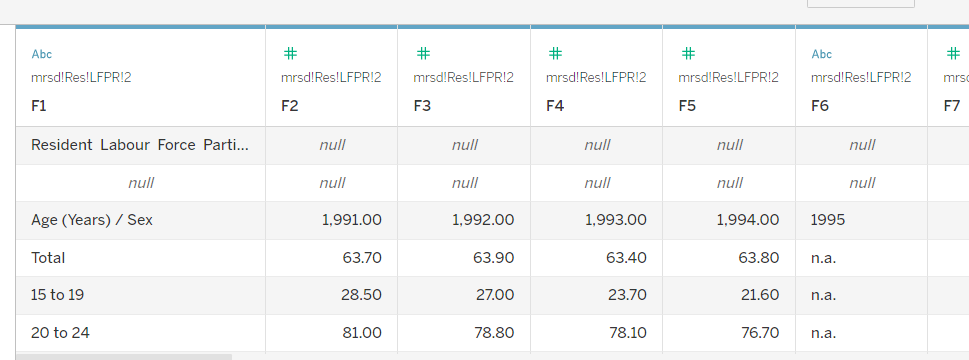 We could see from the graph above that our data frame in xlsx file does work properly in tableau and we need to fix it before we use it. First we need to convert all value types into float and pivot our data frame into standard form 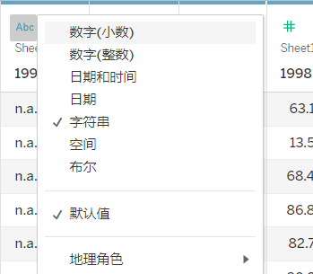    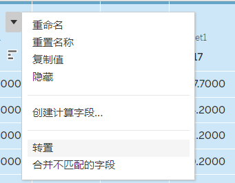

Then we will construct our graph based on data we have. We need to drag measure name into columns and measure values into rows in order to have a continuous year series on x-axis. 
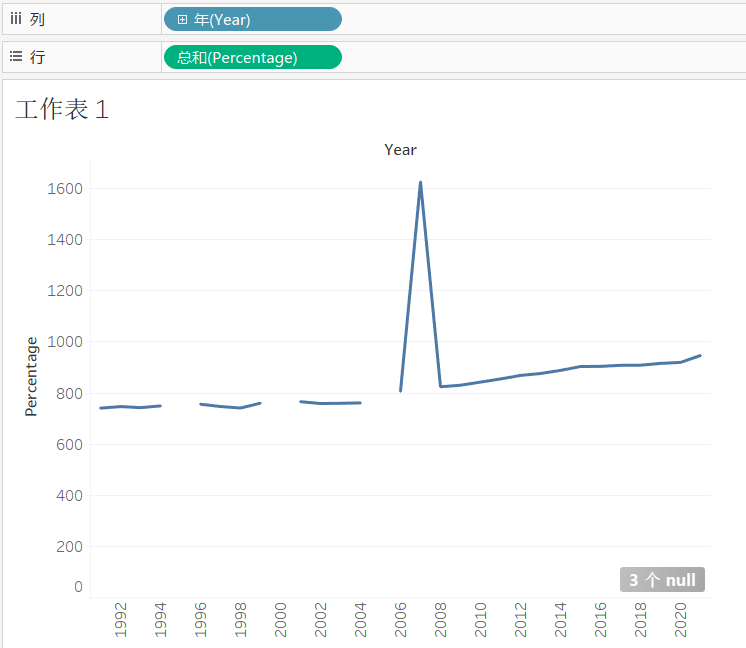The graph above is not discontinuous as we could see, and time spans from 1992 to 2021. That is a quite long time. And we want to focus on the change recently from 2010 to 2021. We will also transform the date form into date. Then we need to apply some techniques to select those date we want to show and display to our audience.
<br />
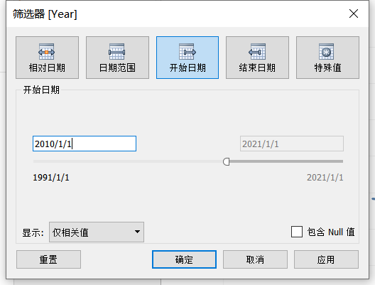
<br />Since we want to find those points that 3 percent greater than the previous year, we need to duplicate the Sum(percentage) in row to create a new horizontal graph in order to show the red dot on those years.<br />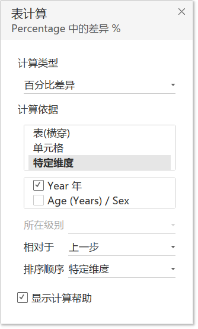<br /> We need to apply and check the calculation of the graph and change the color of the graph based on age group. 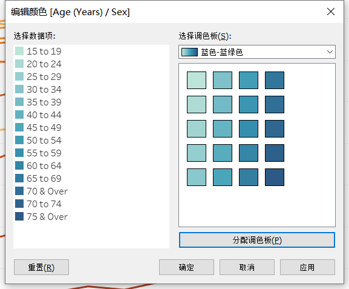 <br />Our graph is displayed below 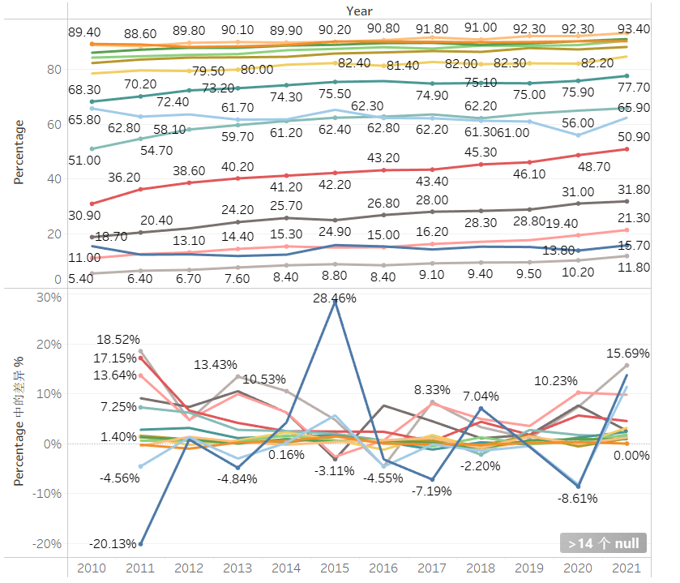. 
<br />My thought is creating an interactive button for people to select how big change they want to see. Then we need to design and create several variables and functions for us to do further interacting with the interface.
<br />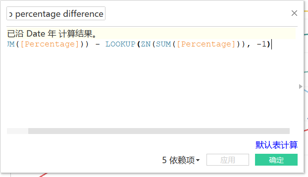 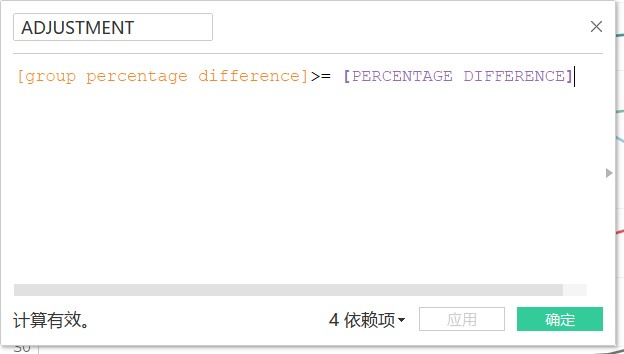 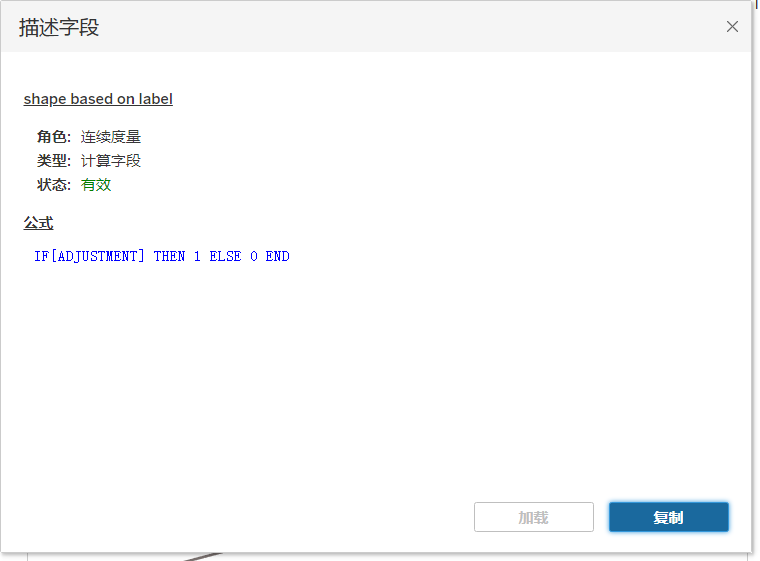<br />One more step for us is to create a parameter to connect those variables by setting appropriate maximum minimum and stepwise. <br />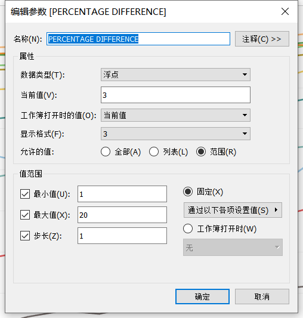 
<br />The next step is to combining both graph into one, since they have the same measure of x-axis and y- axis it is pretty straightforward.We also need to change the transparency shape of the graph to only showing those dots we want to emphasize We all know the pandemic took great impact for Singapore in 2020. So we might also mark those dots in year 2020. <br />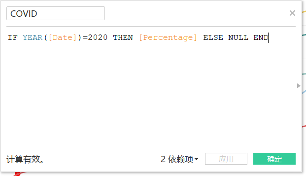

For the second graph it is much easier for us to construct, all we need to do is finding the corresponding value and put them in correct place <br /> <br /> We could also do slightly change to make it become easily to recognize <br />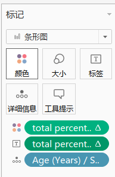 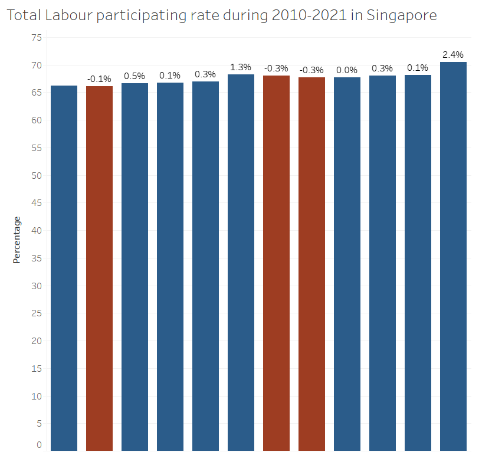


Finally we have proceed to the dash board and design properly, since both graph have the same x-axis I would just hide one to make it more clearly. The final graph showed as below 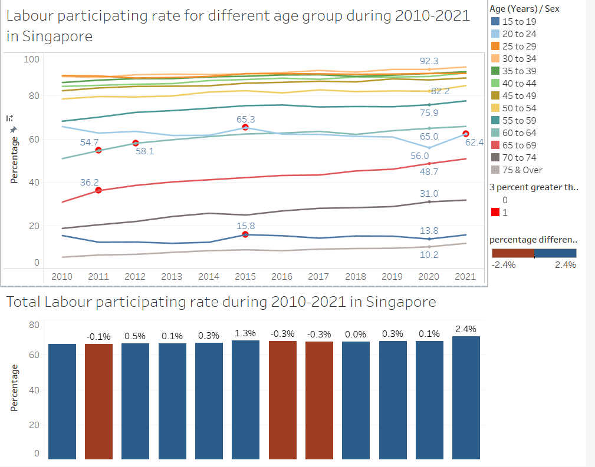

# New insights

## Ageing population in Singapore
As the graph showed above, The percentage of labour participating in People from older age group increases steeply almost every year, which implies that there might be some population structure issue we need to concern about.

## Pandemic in 2020
As we could see from the above graph that percentage of labour participating in all age group in 2020 slightly decrease in 2020. It it because covid-19 make Singapore shut down for a period during 2020. Even the pandemic still exists in 2021, the labour participating rate still increases due to open up policy in Singapore. 

## Working people structure
People age from 30-40 have almost 90% paticipating rate in working. Those people need to support their family, society and companies. Even in 2020 during pandemic their labour participating rate slightly decrease. In the contrast, participating rate of people from20-24 decreases a lot in 2020. 
