```{r setup, include=FALSE}
knitr::opts_chunk$set(echo = TRUE)
```


# Introduction 
 <font size=5pt> The data visualization below is created by using data related to origin-destination bus service in Singapore during January,2022 recorded and extracted by LTA combined with space data file for Singapore providing URA Master Plan 2014 Planning Subzone boundary Map. The data about bus service provide us trip number from origin subzone toward destination subzone during a day in Singapore. In order to do further analysis and traffic planning, we would present the distribution of trips based on 24 hour for any selected subzone, which will give people a comprehensive perspective from time dimension.Meanwhile, the trip number for selected subzone presented on Singapore Subzone Map will also be provided for audience to understand traffic flow between those subzones.

<p>The dashboard we need to revise is displayed below:{width=100%}


# Critque on Prototype

## Clarity 

### Improper Title and Labeling
There is no title for the whole dashboard but only sub-title for each individual graph. The title for the graph need to be clear enough to give audience a first clear impression about what the graph is about. Also reference to the basic principle for designing a statistical chart(https://isss608-ay2021-22t2.netlify.app/lesson/lesson02/lesson02-designing-graphs-to-enlighten#62). For the label on those pie charts, "Time Per Hour" is also not clearly that might create some misunderstanding on our graph.


### Matrix 
Even thought O-D matrix is a well-known technique in analyzing traffic flow. The Adjacency matrix constructed base on our data set is a 300+ X 300+ size matrix, which can not be fully digested for our audience. In my perspective, I really do not think O-D matrix is a good method to use in our case. The O-D matrix could only show our professional but not any meaningful content to audience.

 

### Null Value
Since our data should present the flow between origin and destination, the null value that has missing value on either thing should be excluded on our visualization. Especially for the case when we have a filter that could even select null value, it could create some misunderstanding for audience.

## Aesthetics

###  Color
Since the weekday and weekend data are separated into two different graphs, so the author is trying to compare and find the different patterns between weekday and weekend trip. Keeping that in mind, the color of weekday and weekend could be different in order to provide a better visual shock for comparison.

### Style
The style of the dashboard is too plain to attract people's attention. Data Visualization is not only converting data into graph and presenting to audience. Whether the dashboard is interesting enough to draw people's attention is also an important aspect.

### Highlighting
The dashboard contains lots of graph, and we as the authors should have some selective focus on some of graphs by making difference on the size of the graphs and layouts of graphs. For the prototype dashboard, I do not really know what the author is trying to highlight since the size of those six graphs are roughly the same. 


## Interactive
### Lack of Interactive
Interactive for Data Visualization is optional for different cases. When people are trying to understand a data from a more general aspect, the static visualization is good enough just like DataViz1(https://isss608-ay2021-22t2.netlify.app/dataviz/dataviz1), which people want to know the big picture of Singapore population as well as trends and patterns for different age group in working labour. However, when we are handling a huge data set like origin-destination trip flow, which might contain different clues and phenomenons for different selections, data visualization becomes indispensable. If we only have a static graph or general aggregate trip flow for whole Singapore, it is a failure in data visualization. So having valid interactive in our case is undoubtedly. However, I only see two filters as interactions in the prototype. 


### Synchronous
With interactive function for data visualization, we want to increase the efficiency and keep graphs consistent with our input values or filters, which means all graphs should change with the selection of common parameters. The interactive that involves in prototype is not consistent that the filters could only control the bar chart but not the origin-destination matrix.


### Lack of Dynamics
We are analyzing traffic flow in communication. So presenting the traffic flow from origin to destination in a more dynamic way is welcome. The prototype only have O-D matrix which is not an appropriate method.


# Proposed Design

* I would propose some alternative changes based on the critics above. First, I would also provide two different bar charts for Origin and Destination. For each of them I would also have one as weekday and the other one as weekend but the color for weekday is blue, color for weekend could be orange.At the same time I would also hide away some of the time that bus is out of the service. Adding the reference line for average trip number is also necessary to give people a sense about when will arrive Peak for traffic during the day as well as trough. Since the original intention for giving both weekday and weekend is to compare trip number between those two periods.

* I would use Singapore Subzone map to present the flow between different subzones.Even the propose might be controversial for DataViz that we should revise based on original content from prototype. However, as Professor KAM Tin Seong(https://faculty.smu.edu.sg/profile/kam-tin-seong-486) mentioned about the example of Printer during the class, it is always a trade-off for data visualization to use one function instead of another, the main goal for us is to retain the good graphs and delete those behind graphs. From that perspective, the matrix is trying to provide audience the sense about trafic flow between different subzones. The goal of providing map is the same as giving matrix to people, and the map could be a better way to reach the goal in a more dynamic way.

* For interactive of data visualization, I would use one map as input. When the user select the specific subzone on that map the destination for the selected subzone will all be showed from the next table. Consistency in Synchronous is also important. So not only the map will change but also the bar charts related to the selected origin subzone will also react to the change.

* I will also propose two new horizontal tables showing the top 10 subzones that are destination of the selected subzone on the map for both weekday and weekend. Since I want to show people the major flows out destination to people to better plan the trip.

{width=130%}

# Sketch of dashboard 
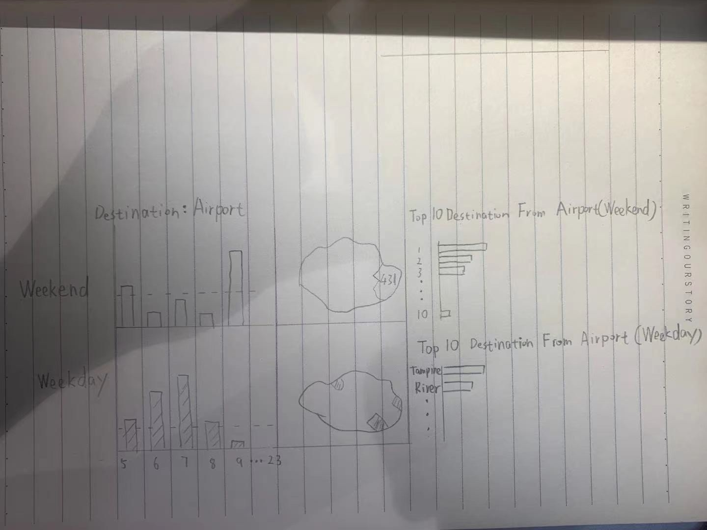{width=120%}


# Step-by-Step Guide on Tableau
## Data importing 
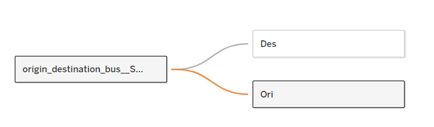{width=100%}
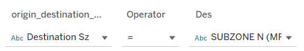{width=100%}

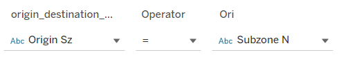{width=100%}

The first thing for us is to find the connection between space file and our data. There are lots of different area name and code that we could group those data by. We would connect our data with space file on Subzone Name, because we have origin and destination subzone name I just duplicate our date into two file and one named as Des the other one name Ori.

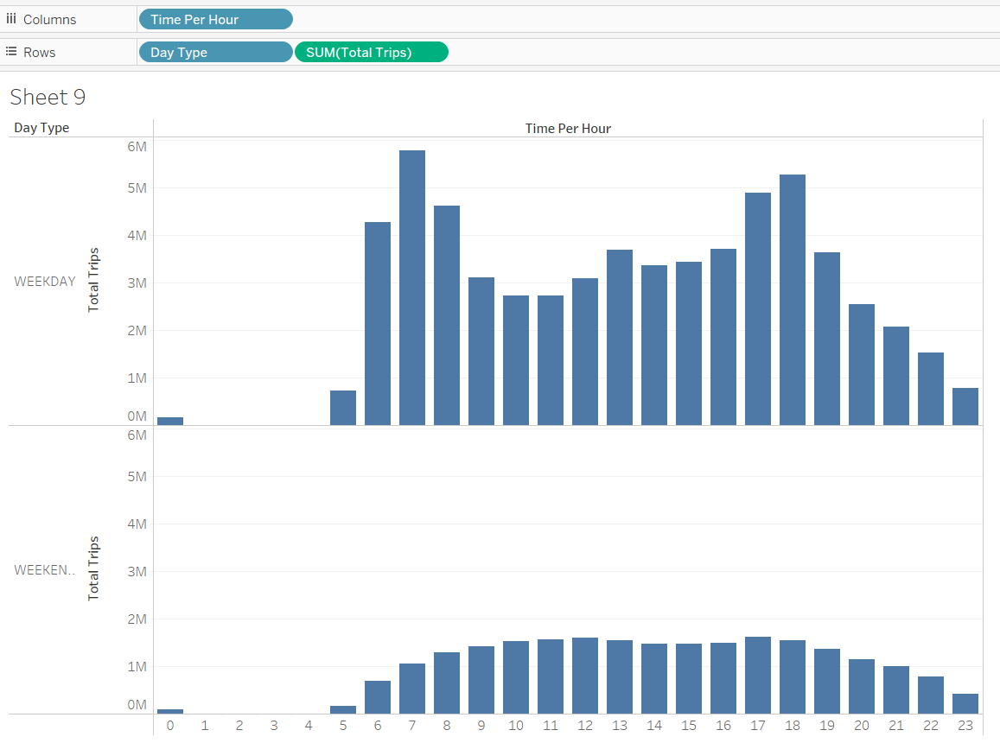{width=100%}

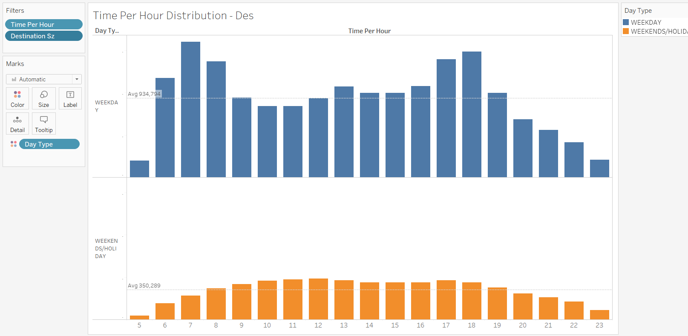{width=100%}
Adding average as reference line and filter by time from 5-23, which is the major and most frequent period for bus service. Making weekday and weekend in different color is also necessary. The steps for both Origin/destination trip distribution pie chart are the same.

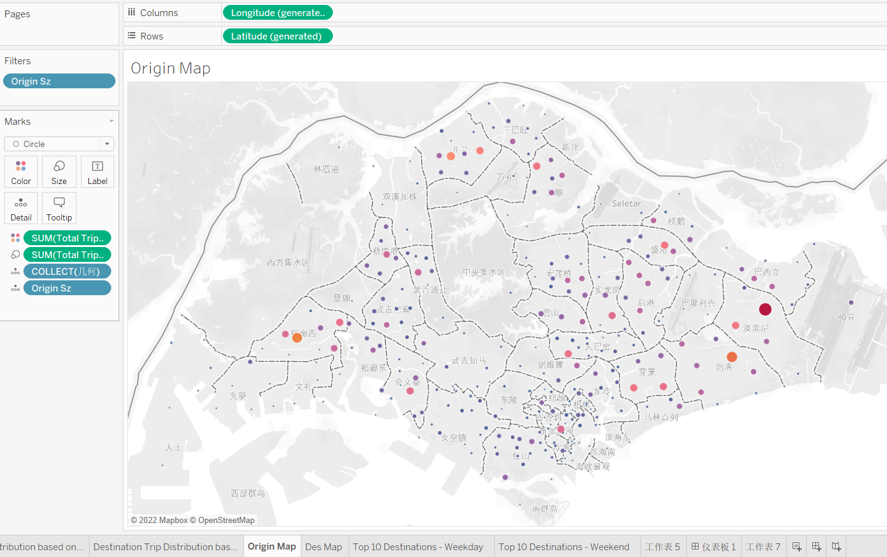{width=100%}
Then we paint out the trip number based on subzones for origin map. Again we could do the same thing for destination subzones.
Next we need to connect both map by parameter function inside tableau. First we need to create a parameter and go to action to pass the parameter to the destination map. Then we could just click on any thing on the origin map and it will goes to parameter to do further reaction easily.
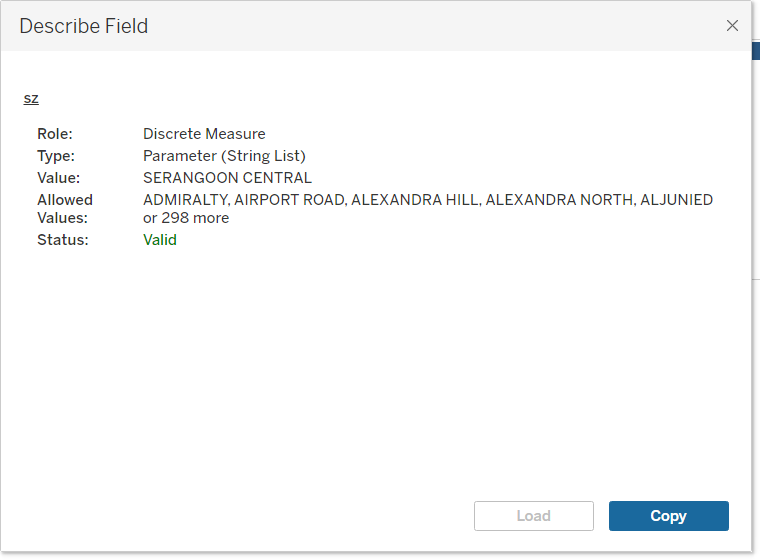{width=100%}
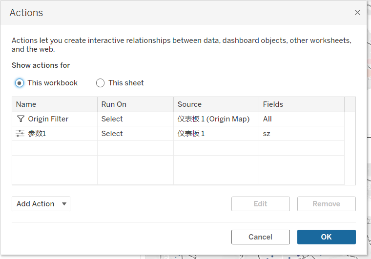{width=100%}
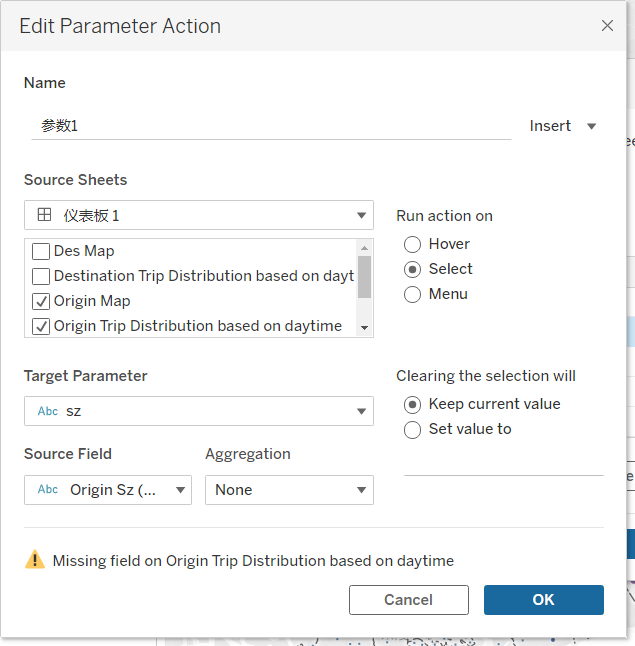{width=100%}
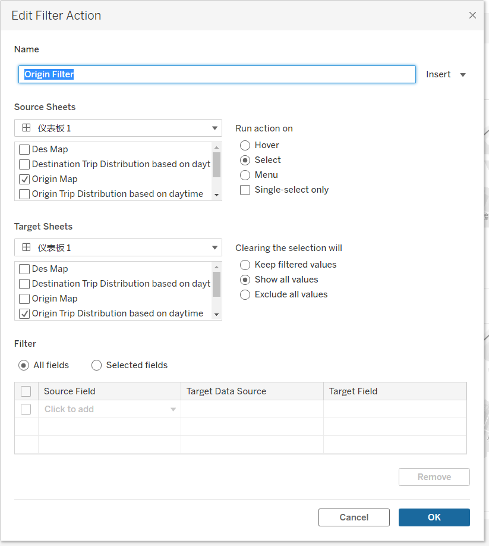{width=100%}
Now the magic happened! We could just click any circle on destination map and all the destinations the trip goes to will showed on the Destination Map.

Another graph I want to present is top 10 destinations from selected subzone.

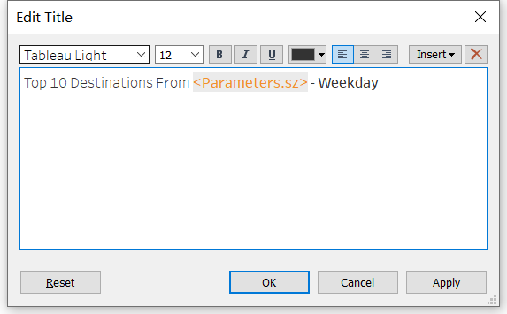{width=100%}
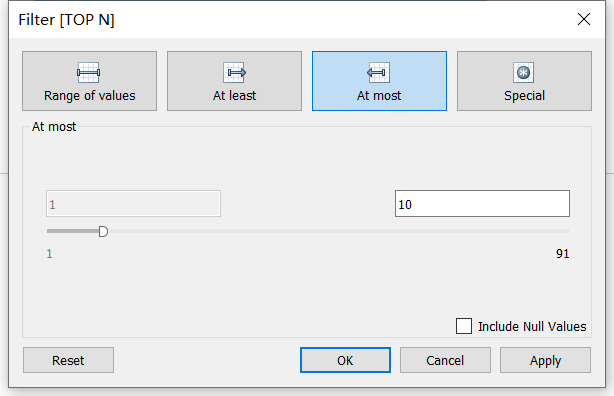{width=100%}
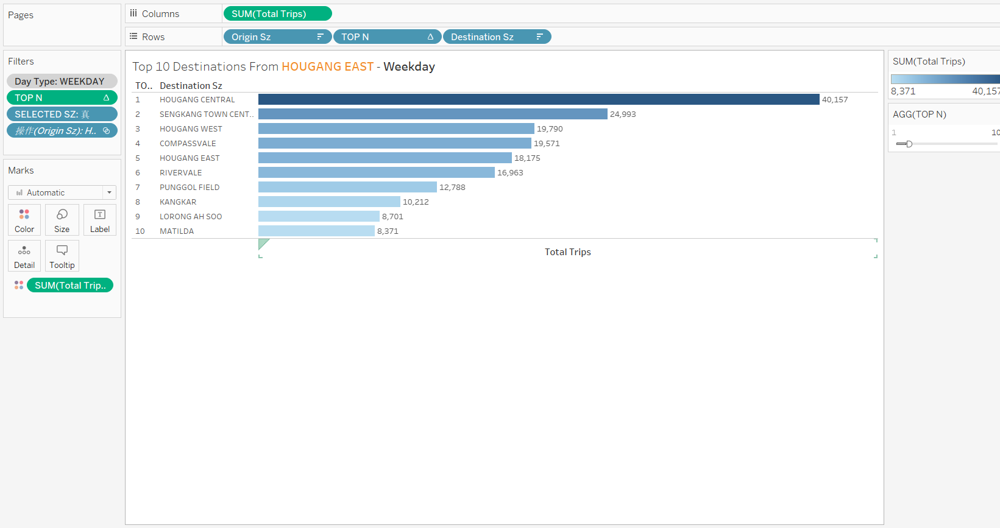{width=100%}
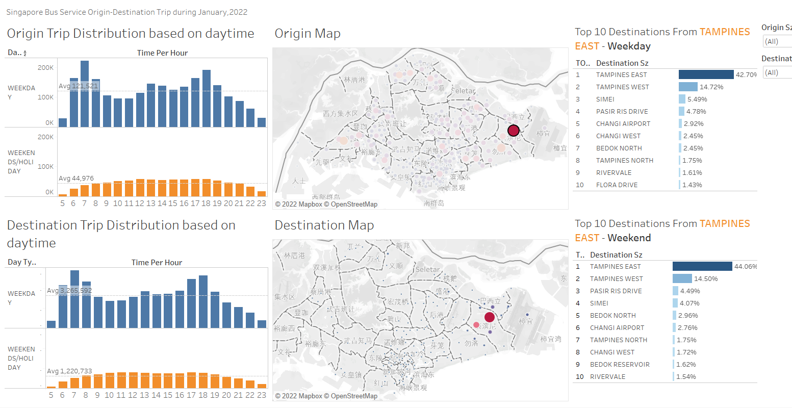{width=120%}


# New insights

## Magnet Effect

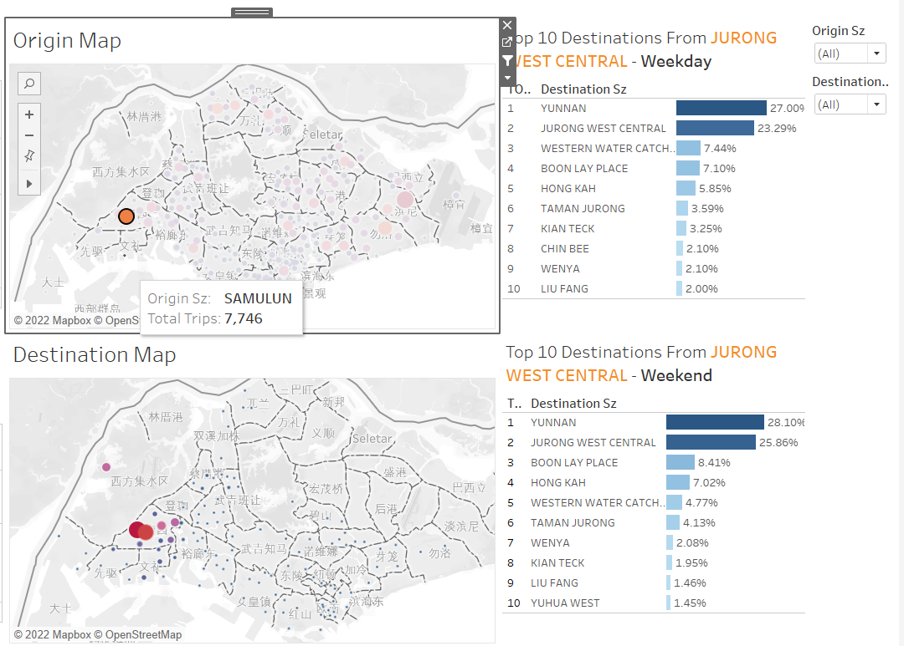{width=100%}
In general, people would like to live at where are close to their working place(Finding from those relative big dot in an area). Those subzone that are near working places, malls or institutions are like a magnet to stations around it, which could attract more trip toward them. Those magnet(local center) has high probability to suffer traffic congestion and high flow in volume.


## Weekday/Weekend Patterns
For weekday, the journey-to-work is around 6-9,the journey-to-home is around 15-17, which is also quiet stable for different subzones. For weekend, the trip for almost all bus services decreases a lot, which means people prefer to take a break and stay at home for the weekend, espacially during this pandemic period.

## Symmetric Shape for Origin and Destination
{width=100%}

As we could see from above graph, the pie chart for origin and destination is almost symmetric, which is also understandable in real case. Since morning people would take the bus leave home and go to the work place and people would leave work place and go home. The graph could help us to recognize the selected subzone is whether a working place or resident area. The selected subzone for graph above is airport road. The peak on origin chart is at night which implies that people might leave this place at night/
The peak for airport road as destination is at morning, combine those two differences we could see air port road is a local center for working. 


