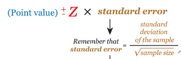
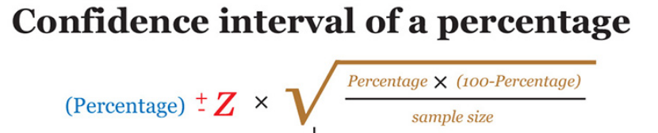

```{r setup, include=FALSE}
knitr::opts_chunk$set(echo = TRUE)
```

## Introduction

<font size="4">Create a data visualisation showing average rating and proportion of cocoa percent (% chocolate) greater than or equal to 70% by top 15 company location. </font>


<font size="4"> Since we are trying to focus on analyzing top 15 companies, we need to do some data cleaning and preparation before analyzing.  </font>
```{r library, echo= FALSE, include=FALSE}

packages = c('ggstatsplot', 'ggside', 'knitr',
             'tidyverse', 'broom', 'ggdist','readxl', 'report', 'performance', 
             'parameters', 'see')
for (p in packages){
  if(!require(p, character.only = T)){
    install.packages(p)
  }
}

```


```{r data import} 

ch= read.csv("data/chocolate.csv")

```


```{r top15 company location}
count <- ch %>% 
  count(`company_location`) %>%
    arrange(desc(n)) %>%
  rename(company_number = n) %>%
     slice(seq_len(15))

  


```


```{r merge(inner join)}
top15 <- merge(ch, count, by = 'company_location' )

```


```{r data type transfer}
top15$cocoa_percent <- as.numeric(sub("%", "",top15$cocoa_percent,fixed=TRUE))/100
```
## Variable Analysis
<font size="4"> Since we are trying to analyze two variables in this task. We could just plot a simple graph to check whether there is a linear relation between these two factors. In other words, we want to see whether customers would leave a high rating for chocolate with high cocoa percentage  </font>
```{r linear relation}
ggscatterstats(
  data = top15,
  x = cocoa_percent,
  y = rating,
  marginal = FALSE,
  )+labs(x= "Cocoa Percentage")
```


<font size="4"> We could see that there is a slightly negative relation between those two variables. It might be because that chocolates with lower Cocoa Percentage is sweeter, which is more welcome to people. </font>

## Construct Confidence Interval for chocolate rating
<font size="4">We could also check whether there is significant difference in rating based on various chocolate producing location.</font>
```{r}
ggbetweenstats(
  data = top15,
  x = company_location, 
  y = rating,
  type = "np",
  messages = TRUE
)+
  scale_x_discrete("company location",guide = guide_axis(n.dodge=2))
```

<font size="4">Based on the graph we plot, we could say that chocolate from U.K. might received slightly different rating compare to Australia, Canada and France.</font>


<font size="4">construct the 95% confidence interval applying formula below:</font>
<p align="center">

</p>
```{r test for average rating}
rating <- top15 %>%
  group_by(company_location) %>%
  summarise(
    n=n(),
    mean=mean(rating),
    sd=sd(rating)
    ) %>%
  mutate(se=sd/sqrt(n-1))
```
```{r}
ggplot(rating) +
  geom_errorbar(
    aes(x=reorder(company_location, n),  #Sort countries based on number of companies in the country in ascending order rather than alphabetical order
        ymin=mean-1.96*se,
        ymax=mean+1.96*se),
    width=0.2, 
    colour="black", 
    alpha=0.9, 
    size=0.5) +
  geom_point(aes
           (x=company_location, 
            y=mean), 
           stat="identity", 
           color="red",
           size = 1.5,
           alpha=1) +
  scale_x_discrete("company location",guide = guide_axis(n.dodge=2))+
  labs(y= "rating")+
  ggtitle("95% confidence interval 
          of average rating of chocolate by company location")
```


<font size="4"> We sort those company location country based on sample size In general, as sample size(n) increases the range of confidence interval we built get smaller. In other words, we are 95% confident to say that the real rating for chocolate is included in our interval. </font>


## Construct Confidence Interval for Proportion


<font size="4">Proportion test requires us to apply another formula:</font>
<p align="center">

</p>
```{r calculate 70% cocoa_percent}
percent <- top15 %>%
  group_by(company_location) %>%
  filter(cocoa_percent>0.7) %>%
  summarise(over=n())
```
```{r finding the exact proportion}
pro <- merge(percent,count, by = 'company_location' )%>%
  rename(size=company_number)
pro$prop<- pro$over/pro$size
```
```{r construct our graph based formula we have}
ggplot(pro) +
  geom_errorbar(
    aes(x=reorder(company_location, size),  
        ymin=(prop-1.96*sqrt((prop*(1-prop))/size))*100,
        ymax=(prop+1.96*sqrt((prop*(1-prop))/size))*100),
    width=0.2, 
    colour="black", 
    alpha=0.9, 
    size=0.5) +
  geom_point(aes
           (x=company_location, 
            y=prop*100), 
           stat="identity", 
           color="red",
           size = 1.5,
           alpha=1) +
  scale_x_discrete("company location",guide = guide_axis(n.dodge=2))+
  labs(y= "Proportion of Cocoa Percentage over 70%")+
  ggtitle("95% confidence interval 
          of propotion of over 70% Cocoa Percentage in chocolate by top 15 country")

```

<font size="4"> Based on the graph we construct, we could say that we are 95% confident that the real proportion of producing chocolate with above 70% cocoa percentage for individual country is inside our interval . </font>


